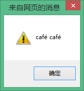
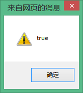

# 浅谈 JavaScript 字符集

### JavaScript 是区分大小写的：

关键字、变量、函数名、和所有的标识符都必须采用一致的大小写 (一般我们都是写成小写的)，这样和当初学 C# 的多样式写法有很大的区别。

比如：(这里以变量 str 和 Str 为例)

```
var str='abc';  
var Str='ABC';  
alert(str);// 输出 abc  
```


假如 str 与 Str 为同一变量，那么 alert(str)；输出的结果应为为 ABC 而不是如上图所示 abc。这恰恰说明：JavaScript 是区分大小写的。

### Unicode 转义序列

Unicode 字符集的出现是为了弥补 ASCII 码只能表示 128 个字符的限制，而日常中我们想显示汉字和日文的话，显然 ASCII 是不可能的了。所以说 Unicode 是 ASCII 和 Latin-1 的超集。首先，JavaScript 程序都是用 Unicode 字符集编写而成的，但在一些计算机硬件和软件里根本无法完整地显示或者输入 Unicode 字符全集 (比如：é)，为了解决这一现象 JavaScript 定义了一种特殊序列，这种序列使用 6 个 ASCII 字符来代表任意 16 位 Unicode 内码，这种特殊序列统称为 Unicode 转义序列，它均以\ u 为前缀，其后跟随 4 个十六进制数

比如：

```
var str='caf\u00e9';  
var Str='café';  
alert(Str+' '+str);// 可以看出显示都是一样的效果。  
alert (Str===str);// 输出 true  
```





但我们应该注意一点，Unicode 是允许多种方法对同一字符进行编码的，用上述的 é 转义的例子来说明：

é：

1. 可以使用 Unicode 字符\ u00E9 表示

2. 亦可用 e\u0301(语调字符)表示

```
var str='caf\u00e9';  
var Str='cafe\u0301';  
alert(str+' '+Str); // 如下图所示, Str 和 str 所输出的结果都是一样的  
alert(Str===str); // 结果是一样的, 可它们的二进制编码表示根本不一样，所以输出 false  
```

虽然显示在文本编辑器上的结果是一样的，可是它们的二进制编码表示根本不一样，而编程语言最终都会转化为本地平台的计算机机械码(二进制编码)，计算机只能通过对二进制编码的比较才能得知结果，所以它们比较最终的结果只能是 false。

所以这正是 “Unicode 是允许多种方法对同一字符进行编码的” 最好的解释，因为 Unicode 标准为所有字符定义了一个首选的编码格式以便于将文本转化成统一格式的 Unicode 转义序列以合适比较

再次以 é 为例：

比较 facé 与 café 中的 é 是否相同？

facé 与 café 中的 é 都转化为\ u00E9 或者都转化为 e\u0301，才能比较 facé 与 café 中的 é。