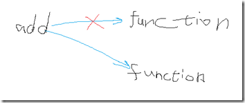

# 浅谈 javascript 对象模型和 function 对象

### javascript 中，函数就是对象

```
<html>   
  
<head>   
  
<script type="text/javascript">  
  
function add(number){   
  
    alert(number+20);   
  
}   
  
var add=function(number){   
  
alert(number+20);   
  
}   
  
function add(number,number1){   
  
    alert(number+30);   
  
}   
  
var add=function(number){   
  
    alert(number+90);   
  
}  
  
add(10);  
  
</script>  
  
</head>   
  
<body>  
  
</body>  
  
</html>  
```

### add 是引用，function 是对象.

跟 java 不一样的地方：javascript 中没有方法重载的概念。方法可以有 n 个参数，而传参数时可以只传 1 个参数。



数据类型 Undefined-- 类型 undefined-- 值

在 JavaScript 中有一个 Function 对象，所有自定义的函数都是 Function 对象类型的。

Function 对象接收所有参数都为字符串类型的，其中最后一个参数是函数体，而前面的参数则是函数真正需要接收的参数。

```
<html>   
  
<head>   
  
<script type="text/javascript">   
  
var add =new Function("number","alert(number+20);");   
  
add(10);   
  
</script>   
  
</head>   
  
<body>  
  
</body>   
  
</html>  
```

在 javascript 中，每一个 Function 对象都有一个隐含的对象 arguments，表示给函数实际传递的参数。

```
<html>   
  
<head>   
  
<script type="text/javascript">   
  
function add(){   
  
alert(arguments.length);   
  
    alert(arguments[0]);   
  
    alert(arguments[1]);   
  
}   
  
add(10,20);   
  
</script>   
  
</head>   
  
<body>   
  
</body>   
  
</html>  
```

java 中的方法重载，javascript 中相对的也可以靠 arguments 来实现。

```
<html>   
  
<head>   
  
<script type="text/javascript">   
  
function add(){   
  
if(1==arguments.length){   
  
    alert(arguments[0]);   
  
}else if(2==arguments.length){   
  
    alert(arguments[0]+arguments[1]);   
  
}else if(3==arguments.length){   
  
    alert(arguments[0]+arguments[1]+arguments[2]);   
  
}   
  
}   
  
add(2);   
  
add(2,3);   
  
add(2,3,4);   
  
</script>   
  
</head>   
  
<body>   
  
</body>   
  
</html>  
```

以上就是本文全部内容了。