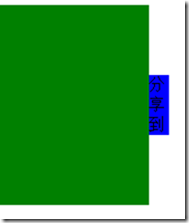

# 浅谈 Javascript 如何实现匀速运动

网站上会经常用到 Javascript 中的运动，这次与大家分享一下一些运动的基本应用。方便大家在开发中能够直接使用。

代码简单易懂，适用于初学者。最后会一步一步整理出一套自己的运动框架。

应用案例效果图：



鼠标移动到分享上 ，左边的 div 就会显示出来。移开会自己恢复。相信这个大家都会用到，很实用。下面看看代码是如何实现的。

```
<style type="text/css">  
 
            #div1 {  
  
                width: 150px;  
  
                height: 200px;  
  
                background: green;  
  
                position: absolute;  
  
                left: -150px;  
  
            }  
 
            #div1 span {  
  
                position: absolute;  
  
                width: 20px;  
  
                height: 60px;  
  
                line-height: 20px;  
  
                background: blue;  
  
                right: -20px;  
  
                top: 70px;  
  
            }  
  
        </style>  

[js] view plaincopy
<body>  
  
        <div id="div1">  
  
            <span>  
  
                分享到  
  
            </span>  
  
        </div>  
  
    </body>  
```

以下是 Javascript 代码

```
<script type="text/javascript">  
  
            window.onload=function(){  
  
                var oDiv=document.getElementById("div1");  
  
                oDiv.onmouseover=function(){  
  
                    startMove(0);  
  
                };  
  
                oDiv.onmouseout=function(){  
  
                    startMove(-150);  
  
                };  
  
            }  
  
            var time=null;  
  
            function startMove(iTraget){  
  
                var oDiv=document.getElementById("div1");  
  
                clearInterval(time);  
  
                time=setInterval(function(){  
  
                    var speed=0;  
  
                    if(oDiv.offsetLeft>iTraget){  
  
                        speed=-10;  
  
                    }else{  
  
                        speed=10;  
  
                    }  
  
                    if(oDiv.offsetLeft==iTraget){  
  
                        clearInterval(time);  
  
                    }else{  
  
                        oDiv.style.left=oDiv.offsetLeft+speed+'px';  
  
                    }  
  
                },30);  
  
            }  
  
        </script>  
```

### 思路：

样式中初始的 left 是- 150 这样 div 就是缩在里面，给 0 就会显示出来。那么我们只要变动这个值就可以了

startMove 中的参数 iTarget 是目标点，表示到哪个目标点会停下来。

控制 speed 的大小 就能控制运动的快慢。如果达到目标点 就停止定时器。

### 规律：

- 假设

- left:30 iTarget:300 得出 往右 为正 

- left:600 iTarget:50 得出 往左 为负 

- 通过当前位置 left 与目标点的 关系 iTarget 推断出 速度的正负

注意： 一上来就要关了定时器，因为是每次移动到分享到，都会开个定时器，开的越多相对来说速度就越快，因为同时会有多个定时器执行。所以每次要保证一个定时器工作。

遵循：函数功能一样，参数越少越好的原则 ，所以根据上面的规律把 speed 并不是作为参数传入。

举个生活中的例子：你打车，告诉出租车司机已 100 码的速度到哪哪哪，一般是不可能的吧。打车你不可能告诉师傅你要跑多快。

所以程序也是一样的，这里就把速度这个传参去掉了。

当然现在的这个运动框架还会有许多问题，在之后会陆续解决。下篇文章，我们来探讨下匀速运动如何停止。