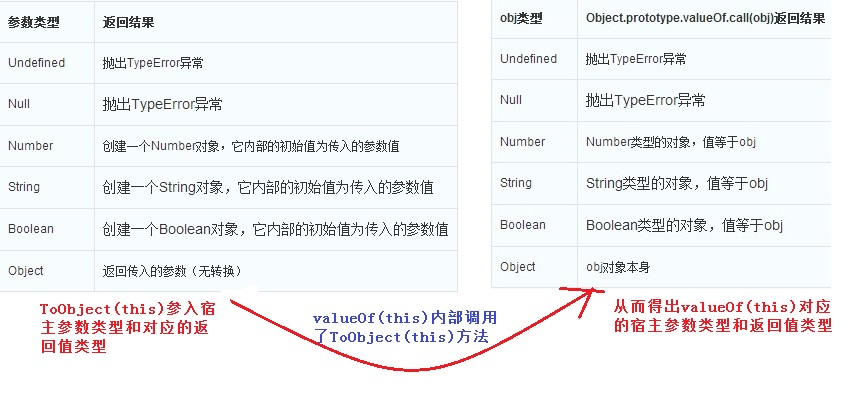

# 浅谈 javascript 六种数据类型以及特殊注意点

在 js 中常见的六种数据类型：String 类型、Null 类型、Number 类型、Boolean 类型、Object 类型。

## typeof 的注意点

涉及到数据类型，不免会提到，操作符 typeof。要注意：

1. typeof 是操作符，不是方法。虽然我们经常使用 typeof() 的方式获取对象的数据类型。
2. 对 null 取 typeof 是 object（这是因为 null 是 空的对象引用），对函数取 typeof 是 function。

```
alert(typeof null);    // 返回 object  
function demo(){  
      alert('demo');  
    }  
alert(typeof demo);     // 返回  function  
```

## 为各种数据类型的对象变量设置初始值

注意，如果 Object 类型的 对象变量开始不知道赋值什么，不要 var demo={}；最好是 设置成 null；

```
var d2=null;  
d2={'key':"shit"};  
  
var d3='';// 字符串 默认  
var d4=0;   //Number 类型 初始值设置为 0  
var d5=null; // 对 object 类型设置初始默认值  
```

## undefined 和 null 的区别和注意点

1、如果用 “==” 进行比较，他们是相等的，因为比较的是值

2、区分他们有两种方法（他们的核心都是比较他们的 数据类型）

1）使用 typeof 将他们区分开 

2）使用全等 “===” ：比较的是 值和 数据类型，只有全都相同 才返回 true

```
alert(undefined == null);             //true  
alert(typeof undefined == typeof null); //false  
alert(undefined === null);             //true  
```

## Boolean 的注意点

1、true 和 1 比较是相同，false 和 0 比较是相同（是 “==” 比较），因为内部会实现 数据类型的 转化，将 true 转换成 1，将 false 转换成 0. js 内部有很多数据类型的自动转换，这是大家一定要注意的。后面还会提到很多。但是使用 “===” 就不相等了，因为 他们的数据类型是不等的。

2、显示转换成 Boolean，使用 Boolean() 方法显示转换，需要注意的是各种数据类型，什么时候转换成 true 什么时候转换成 false

1）String 类型，只要不是 空字符串 都会 转换成 true

2）Number 类型，只要不是 0 ，即使是 负数，都会转换成 true

3)Object 类型，只要 不是 null 类型，都会转换成 true

4）Undefined 类型，都会转换成 false

我就不做演示，大家可以自己动手试一下。

3、（***）if()语句的()内部就是调用了 Boolean 函数

## Number 类型注意点

1、float 类型 不能做精准运算

```
alert(0.1+0.2);// 返回 0.300000000000000004  
```

2、 支持 科学计数法 运算

3、NaN（Not a Number）

1）var d=0/0; 注意：在 js 里 是不会报错的，而是返回 NaN

2）可以通过 Number.NaN 来获取 

3）NaN 和 任何 对象做运算都会返回 NaN

4）isNaN() 判断是不是 NaN

```
alert(isNaN(NaN));//true  
alert(isNaN(12));//false  
alert(isNaN('123'));//false: 因为 字符串类型 的数字 可以自动转换成  数字  
alert(isNaN('lew'));//true  
alert(isNaN(false));//(*)false: 因为 bool  值 可以转换成数字，true 变 1，，false 变 0  
```

5）isNaN()内部执行原理：同样适用于对象。实现原理：首相调用对象的 valueOf()方法，如果能转换成数字就直接做判断；如果不能就再调用 toString()方法，然后测试返回值。

valueOf()内部调用了 toObject()方法，两个方法的内部执行的原理：如下图：




```
var box={  
        // 重写  box 对象的 toString()  方法  
        toString:function(){  
              return '123';  
            }  
    };  
alert(isNaN(box));//false  
alert(box);//123   alert() 内部也是 先调用了 对象的 valueOf()  然后调用 toString() 方法  
```

6）将其他数据类型转换成 Number 类型

含有三个函数：Number(): 可以针对所有的数据类型进行转换；parseInt()和 parseFloat()只针对 字符串进行转化。

```
alert(Number('123'));//123  
alert(Number('0234'));//234  
alert(Number(true));//1  
alert(Number(null));//(**)0  
  
// 除了 上面的  其他的都是 返回 NaN  
alert(Number(undefined))//NaN  
```

Number()内部实现的原理：同 isNaN()也是先调用 valueOf()然后调用 toString()。所以可想而知，性能是比较差的。所以所过只要要被转型的对象是字符串的话，就调用 parseInt()或者 parseFloat()为他们内部不需要对类型做判断。

parseInt()和 parseFloat()调用注意：从第一个为数字的字符开始一直到第一个部位数字的字符的前一个数字的这部分字符串转换成数字

```
alert(parseInt('123leb'));//123  
alert(parseInt('123leb345'));//123  
alert(parseInt('len234'));//NaN  
```

当 parseInt()里面的参数是 float 类型的那么只取得数字的整数部分

```
alert(parseInt(56.12));//56  
```

## String 类型

1）（* 重要 *）在 ECMAScript 中 字符串有不变性：字符串创建之后就不会再改变。

要改变一个已经被赋值的字符串变量，首先要先销毁变量中字符串，然后再用一个包含新值的字符串填充变量。

```
var d='hello';  
d=d+'shit';// 执行过程：先将 'hello'赋值一份，然后将 d 中的字符串清空，将字符串 'hello' 和 'shit'进行拼接，然后赋值给 d 变量。（所以 字符串 的值 一旦 被 创建之后 就不会 改变）  
```

2）toString()方法将其他数据类型转换成 String 类型。但是如果对 null 或 undefined 进行操作的话就会报错。

3）但是 String()方法同样能实现 toString()的效果，但是 可以对 null 和 undefined 进行操作。

内部原理：先 调用 toString()，如果可以转换成字符串，就将结果直接返回。否，再进行判断是 null 还是 undefined，然后返回‘null' 或 ‘undefined'

总结：如果知道 变量不可能是 null 或 undefined，就使用 toString()性能比 String()，因为 String()内部还要做判断，所以有损性能。