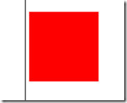

# 浅谈 Javascript 中匀速运动的停止条件

我们先来看下之前的匀速运动的代码，修改了速度 speed 后会出现怎么样的一个 bug。这里加了两个标杆用于测试。

```
<style type="text/css">  
 
            #div1 {  
  
                width: 100px;  
  
                height: 100px;  
  
                position: absolute;  
  
                background: red;  
  
                top: 50px;  
  
                left: 600px;  
  
            }  
 
            #div2 {  
  
                width: 1px;  
  
                height: 300px;  
  
                position: absolute;  
  
                left: 300px;  
  
                top: 0;  
  
                background: black;  
  
            }  
 
            #div3 {  
  
                width: 1px;  
  
                height: 300px;  
  
                position: absolute;  
  
                left: 100px;  
  
                top: 0;  
  
                background: black;  
  
            }  
  
        </style>  
  
        <script type="text/javascript">  
  
            var time = null;  
  
            function startMove(iTarget) {  
  
                var oDiv = document.getElementById("div1");  
  
                clearInterval(time);  
  
                time = setInterval(function() {  
  
                    var speed = 0;  
  
                    if (oDiv.offsetLeft < iTarget) {  
  
                        speed = 7;  
  
                    } else {  
  
                        speed = -7;  
  
                    }  
  
                    // 其实这种情况是有问题的  
  
                    oDiv.style.left = oDiv.offsetLeft + speed + 'px';  
  
                      
  
                }, 30)  
  
            }  
  
        </script>  
  
    </head>  
  
    <body>  
  
        <input type="button" id="btn" value="到 100" onclick="startMove(100)" />  
  
        <input type="button" id="btn" value="到 300" onclick="startMove(300)" />  
  
        <div id="div1">  
  
        </div>  
  
        <div id="div2">  
  
        </div>  
  
        <div id="div3">  
  
        </div>  
  
    </body>  
```

其实这样的代码如果把速度改成 7 这种奇数，而到达目标点却是一个整数，这样就会出现未能达目标点或超过目标点来回抖动的 bug。




那为什么会出现这种情况呢 ？

实际上来说他到达目标点的时候无法精确到目标点，若目标点是 100，每次走 7 个，这个时候他要么就是过了目标点，要么就是没过。

永远到不了目标点。其实帮之前的缓冲有点像。

那么到底怎么算才是到达了目标点呢？

举个例子：你打车到某个地方，司机肯定是到哪里差不多离个 10 米 20 米就停下来了，就算到了。不可能要求汽车贴到那个地方停下来吧。

所以说呢，其实来讲程序也是一样的，我们只要物体和目标点之间的距离近到一定的程度，就不需要再近了，就认为到了。

我们看下修改后的代码：

```
<script type="text/javascript">  
  
            var time = null;  
            function startMove(iTarget) {  
  
                var oDiv = document.getElementById("div1");  
  
                clearInterval(time);  
  
                time = setInterval(function() {  
  
                    var speed = 0;  
  
                    if (oDiv.offsetLeft < iTarget) {  
  
                        speed = 7;  
  
                    } else {  
  
                        speed = -7;  
  
                    }  
  
                    if (Math.abs(iTarget - oDiv.offsetLeft) <= 7) {  
  
                        clearInterval(time);  
  
                        oDiv.style.left=iTarget+'px';  
  
                    } else {  
  
                        oDiv.style.left = oDiv.offsetLeft + speed + 'px';  
  
                    }  
  
                      
  
                }, 30)  
  
            }  
  
        </script>  
```

解释一下： 这里为什么要用 Math.abs 取绝对值呢？

理由很简单，因为速度可能是正的可能是负的。

现在我们让目标和物体之间的距离只要小于等 7, 那就算到了。为什么是 7 呢？因为他下一次的运动都不足 7 个了。这个时候我们就算他到了目标点了。

那现在问题又来了， 这样写 他并没有精确的停在目标点的位置。所以我们加了一句简单的话，直接让 left 等于目标点。oDiv.style.left=iTarget+'px';

实际上最后一次走的不足 7 个，但是大家都知道程序这个运行的太快了，人眼是看不出来的。

这个时候就没有问题了。

这个就是匀速运动的停止条件。 那有朋友问，为什么缓冲运动没有这么麻烦呢？

因为他的速度是变的，越来越小，直到最后他甚至就到达 1 了，一步一步往前肯定不会出现这样的问题。